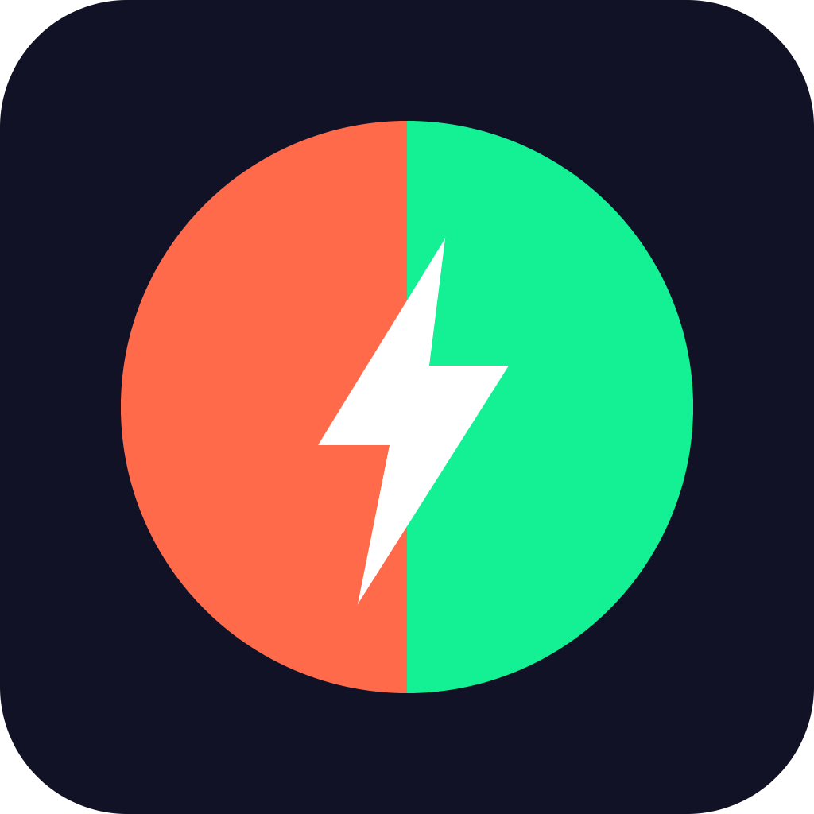

# Wagerly


Instant micro-prediction markets for everyday moments, settled in seconds on Solana.

## Overview
Wagerly lets friends and communities create tiny, fast-resolving prediction markets on anything — sports moments, local events, livestreams — settled instantly on Solana. It's designed for fun, social, low-stakes betting rather than complex DeFi trading.

## Problem
Existing prediction markets are slow, complex, or too serious for casual social betting among friends or stream audiences. People just want to make a quick, lighthearted bet on something happening right now, not navigate a full trading interface.

## Solution
Wagerly is a lightweight Solana app where anyone can create a yes/no market in seconds, invite others, and have funds settle automatically via an oracle or group consensus. No complex order books, no waiting — just a question, a timer, and a pool.

## Features (MVP)
- One-tap market creation with a custom question and timer
- Group betting pool using USDC with automatic payout split
- Simple oracle or 'majority vote' resolution for casual markets
- Shareable market links for Discord, Twitch, and X communities
- Live leaderboard of top predictors

## Tech Stack
- Anchor (Solana smart contracts)
- Next.js (frontend)
- Solana Pay (payments)
- Switchboard oracle (resolution)
- Discord bot integration
- USDC (settlement currency)

## How It Works

```
[User] -> creates market (question + timer) -> [Next.js App]
   |
   v
[Shareable Link] -> Discord / Twitch / X
   |
   v
[Friends join] -> deposit USDC -> [Anchor Program on Solana]
   |
   v
[Market resolves] -> Switchboard oracle OR majority vote
   |
   v
[Anchor Program] -> auto-settles payouts to winners' wallets
```

All bets, pools, and settlements are handled by an Anchor program on Solana. USDC is deposited into a market-specific pool, and once the market resolves — either via a Switchboard oracle feed or a simple group majority vote — the program automatically splits and distributes payouts on-chain.

## Roadmap
- Add creator-hosted markets with revenue share
- Integrate with Twitch/Discord bots for live audience betting
- Explore token-gated private leagues and tournaments

## Pitch
See our full pitch deck at [docs/pitch.pdf](docs/pitch.pdf) and the spoken pitch script at [docs/pitch-script.md](docs/pitch-script.md).

## Team
- [Name] — Role (placeholder)
- [Name] — Role (placeholder)
- [Name] — Role (placeholder)

Built for the Colosseum hackathon.

---

🎬 Pitch video: [docs/pitch-video.mp4](docs/pitch-video.mp4)


## Prototype

Live prototype: https://s25k1010mm-ishihara.github.io/wagerly/

The source is [docs/index.html](docs/index.html) (served with GitHub Pages from the /docs folder). All data is simulated.
